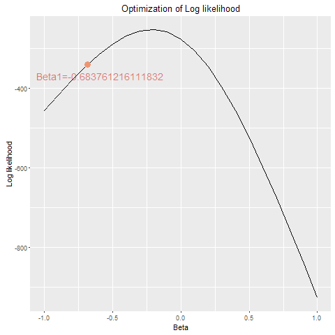

<!-- 

install.packages('ggplot2')
install.packages('animation')

Download ffmpeg for macOSx: http://www.osxexperts.net/ffmpeg/ffmpegexperts.html

For windows check: ffmpeg.zeranoe.com/builds/#

Install FFmpeg and add the folder .\ffmpeg\bin to your path, for example C:\ffmpeg\bin (on Windows, open cmd.exe, type set path=%PATH%;C:\ffmpeg\bin. Be very careful not to accidentally delete your path!).


More info:
http://stackoverflow.com/questions/12038893/combining-r-markdown-and-animation-package

-->


----

\begin{center}
Yi He

s1684698
\end{center}

----


# Visualization for Logistic Regression

## Background

Wether you are admitted (yes or no) to a school could depend on the grade point average of your previous school, right? In statistics this is a typical problem for which you could use logistic regression analysis. Your dependent / outcome variable of interest is binary (0 or 1), and there is a logit
link included.

The logist regression formula you will work with is:

$$\log{\frac{\mathbf{p}}{1 - \mathbf{p}}} = \mathbf{X}\boldsymbol \beta,$$

where $\mathbf X$ is the data in $n \times p$ matrix form, where *n* (students) is the number of observations and *p* is the number of predictors + intercept. The $\boldsymbol{\beta}$ are the predictor coefficients in one-column matrix, or column-vector form. The column-vector $\mathbf p$ contains the probability estimates derived from $\mathbf X$ and $\boldsymbol \beta$, e.g. the probability of getting admitted to the specific school.


Solving the logistic regression formula for $\mathbf p$ gives
$$ \mathbf{p} = \frac{\exp(\mathbf{X}\boldsymbol{\beta})}{\{1 +\exp(\mathbf{X}\boldsymbol{\beta})\}}. $$


In this assignment we will apply logistic regression on the `binary.csv` data set. The data contains information about admittance to a school. Each row indicates a student, and each column a variable. In this assignment we will only use the the grade point average (`gpa`) and the admittance (`admit`) variables of the dataset. The `gpa` represents the grade point average from the student's last school, and is the predictor variable. The `admit` variable tells if the student was rejected (0) or admitted (1), and is the outcome variable. 


# 1. Inspecting the data
*Outcome: Good-looking but functional plots*

**Q1.1** By using `read.csv`, read directly the binary.csv data from [http://www.ats.ucla.edu/stat/data/binary.csv](http://www.ats.ucla.edu/stat/data/binary.csv) into an object. 
```{r}
data.bin <- read.csv('http://www.ats.ucla.edu/stat/data/binary.csv')
```

**Q1.2** Change the `admit` variable into a factor with the levels c('rejected','admitted'). 
```{r}
data.bin$admit <- factor(data.bin$admit, labels = c('rejected', 'admitted'))
```

**Q1.3** If you haven't done so, inspect your data object using the functions `str`,`head`, and `summary`. However, do not show or use this code in this report.

Use ggplot2 to ...

+ **1.3a** ... plot the counts of admitted and rejected students by a bar chart.    
```{r}
library(ggplot2)
library(grid)
ggplot(data.bin, aes(x = admit, fill = admit)) + 
  theme(plot.margin = unit(c(1, 1, 1, 1), "cm")) + 
  geom_bar(width = 0.3) + 
  ggtitle('1.3a Bar chart') + 
  ylab('Frequency')
  
```

+ **1.3b** ... compare the distribution of gpa between admitted and rejected students in two histogram plots beside each other.
```{r}
ggplot(data.bin, aes(x = gpa)) + 
  geom_histogram(binwidth = 0.1, aes(y = ..count.., fill = ..count..)) + 
  theme(plot.margin = unit(c(1, 1, 1, 1), "cm")) +
  ggtitle('1.3b Histograms of GPA') + 
  facet_grid(. ~ admit) + 
  ylab('Frequency') + 
  xlab('GPA')
```

+ **1.3c** ... compare the distribution of gpa between admitted and rejected students in two boxplot plots beside each other.
```{r}
ggplot(data.bin, aes(x = admit, y = gpa)) + 
  geom_boxplot(width = 0.6) + 
  geom_jitter(aes(color = gpa), alpha = 0.5) + 
  theme(plot.margin = unit(c(1, 1, 1, 1), "cm")) + 
  ggtitle('1.3c Boxplot of GPA') + 
  ylab('GPA')
```

**Q1.4**

Use the package metricsgraphics to include interactive histograms of gpa, split by rejected and admitted students. Note that in the help-file the `magrittr` pipe operator `%>%`, is being used.
If needed, check out [this website](http://www.r-statistics.com/2014/08/simpler-r-coding-with-pipes-the-present-and-future-of-the-magrittr-package/) on the `%>%` operator. Why do you think these histograms might differ from the histograms in ggplot2 package?
```{r, message = F}
library(magrittr)
library(metricsgraphics)
library(dplyr)
```

```{r}
plot.pipe <- lapply(1:2, function(x) data.bin %>%
                     filter(as.numeric(admit) %>% equals(x)) %>% 
                     mjs_plot(gpa, width="300px", height="300px") %>%
                     mjs_histogram(bins=20, bar_margin =2) %>%
                     mjs_axis_x(min_x = 2, max_x = 4) %>%
                     mjs_labs(x_label = levels(data.bin$admit)[x], 
                              y_label = 'Frequency'))
mjs_grid(plot.pipe, nrow = 1, ncol=2, widths=c(rep(0.33, 2)))
```

These histograms are slightly different from those created by ggplot2 because the bins and binwidthes are not the same. For example, assume there is a sample A, in case 1.3b it might be in the third bin, but in case 1.4 it might be in the fourth bin, which leads to the count differs from one to another. And they are interactive while in case 1.3b they are static.

## 2. The Log Likelihood

**Q2.1** Use an existing R function from the `stats` package to perform a logistic regression analysis with a logit link. Regress the outcome  variable `admit`, on the predictor variable `gpa`. Print the summary of your logistic regression object. 
```{r}
mod.1 <- glm(admit ~ gpa, data = data.bin, family = "binomial")
summary(mod.1)
```


**Q2.2** Do the anylsis again, but this time without intercept. Print the summary of your logistic regression object. What assumption do you force upon your model now?    
Assume that gpa can fully interpret the admission status. 
In this case, when GPA equals to 0, the regression line passes 0, thus the probability to be admitted equals to 0.5. 
```{r}
mod.2 <- glm(admit ~ gpa - 1, data = data.bin, family = "binomial")
summary(mod.2)
```

Behind the scenes, R optimized the likelihood belonging to the logistic regression problem in exercise 2. It gave you the coefficients $\boldsymbol\beta$ most likely given the data and its outcomes. In this latter exercise we visualize the steps that an optimization process.

**Q2.3** Read in your data again. Keep all variables numeric. Reassign your data column gpa to a matrix $\mathbf X$, and your data column admit to a matrix $\mathbf y$. A one-column matrix is also called a column vector.
```{r}
data.bin <- read.csv('http://www.ats.ucla.edu/stat/data/binary.csv')
X <- as.matrix(data.bin$gpa)
y <- as.matrix(data.bin$admit)
```

**Q2.4**

Logistic regression models are usually fitted by maximum likelihood optimization. The loglikelihood to be optimized is given by this formula:
$$\ell(\boldsymbol{\beta}) = \mathbf{y}^\mathrm{T} \log\mathbf{p}+(1-\mathbf{y})^\mathrm{T}\log(1 - \mathbf{p}).$$

Using $\ell(\boldsymbol{\beta})$ and the formula to calculate $\mathbf p$ from $\boldsymbol\beta$ and $\mathbf X$, make a function that calculates the likelihood of the coefficient. Use (extremely simple) matrix multiplications (the operator `%*%` and `t()` funcion are very useful).

```{r}
LogLik <- function(X, y, beta) {
  # Calculate log likelihood of possible coefficients.
  #
  # Args:
  #   X: matrix with predictor values
  #   y: binary outcome vector
  #   beta: column vector of possible coefficients
  #
  # Returns: 
  #   Log likelihood of beta.
  p <- exp(X %*% beta) / (1 + exp(X %*% beta))
  LogLik <- t(y) %*% log(p) + t(1 - y) %*% log(1 - p)
  return(LogLik)
}
```

**Q2.5**

Notice that an AIC estimate is given in the summary of your logistic regression models. Given a collection of models for the data, AIC estimates the quality of each model, relative to each of the other models. Hence, AIC provides a means for model selection. If you know what is a log likelihood (the lower the better), and know that 

$$AIC = 2*P - 2*\ell(\boldsymbol{\beta}),$$

then you would see that a lower AIC would represent a better model fit. Use your LogLik function to reproduce the `AIC`'s of the model of **Q2.1** and **Q2.6**.

Note that for including an intercept, a column of 1's needs to be added to your $\mathbf{X}$ matrix, and only for this question.
```{r}
(mod.1.aic <- 2 * 2 - 2 * LogLik(cbind(1, X), y, mod.1$coefficients))
(mod.2.aic <- 2 * 1 - 2 * LogLik(X, y, mod.2$coefficients))
```

**Q2.7**
Although we can see that the logistic model with the intercept is better, for programming purposes we are going to calculate further with the model without intercept. Hence, *p* = 1. Plot a line graph of the log likelihood of possible $\boldsymbol\beta$'s, in a range from -1 to 1 by steps of 0.1.
```{r}
likx <- seq(-1,1,0.1)
liky <- as.numeric(LogLik(X, y, seq(-1, 1, 0.1)))
qplot(y = liky, x = likx, geom = 'line') + 
  theme(plot.margin = unit(c(1, 1, 1, 1), "cm")) + 
  labs(x = 'Beta', y = 'Log likelihood', 
       title = '2.7 Log likelihood of mod.2')
```

## 3 Optimization
*Outcome: A little movie of an optimization problem*

**Q3.1** 

The log likelihood has continuous first and second derivatives, and suppose we want to find an optimizer $\beta^*$ for

$$ \ell(\boldsymbol{\beta}) = \mathbf{y}^\mathrm{T} \log\mathbf{p}+(1
-\mathbf{y})^\mathrm{T}\log(1 - \mathbf{p}),$$

in an interval $[a,b]$. If the optimizer does not coincide with $a$ or $b$, it will satisfy $\ell(\boldsymbol{\beta})' = 0$. If moreover $\ell(\boldsymbol{\beta})'' < 0$, this point is a local maximum of $\ell(\boldsymbol{\beta})$. The Newton-Raphson algorithm is based on these properties:


- We give an initial guess of the maximizer $\boldsymbol \beta^{(0)}$ and we compute an improved guess using the solution:  $$\boldsymbol \beta^{(1)} = \boldsymbol \beta^{(0)} + \frac{\ell(\beta_0)'}{\ell(\beta_0)''}.$$ Then we use $\boldsymbol \beta^{(1)}$ in place of $\boldsymbol \beta^{(0)}$ to obtain a new update $\boldsymbol \beta^{(2)}$ and so on.

- The iterations stop when $\ell(\boldsymbol \beta^{(0)})'$ is close enough to zero, which happens when $abs(sum(\boldsymbol \beta^{(last)} - \boldsymbol \beta^{(last - 1)}) < 10^{-6}$.

We are going to use the *Newton-Raphson algorithm* for optimization of the log likelihood. Using the chain rule we know that 

$$\ell(\boldsymbol{\beta})' = \mathbf X^T (\mathbf y - \mathbf p)$$ 

and, the Hessian matrix,

$$\ell(\boldsymbol{\beta})'' = \mathbf X^T\mathbf{VX},$$

where $\mathbf{V}$ is the *n*-diagonal matrix with the scalar values $\mathbf p_{i}(1-\mathbf p_i)$ for $i = 1, \ldots, n$. So for improving our guesses we use:

$$ \boldsymbol \beta_{i + 1} = \boldsymbol \beta_{i} + (\mathbf X^T\mathbf{VX})^{-1}\mathbf X^T (\mathbf y - \mathbf p) $$

See for yourself whether this holds by leveling up your calculus skills (use the chain rule, and simplify the matrix algebra into scalar notations (summations of) for $y_i$ only). Or be rocking, and go for the [matrix algebra calculus](http://matrixcookbook.com) directly. 

Hence, with an initial guess for the optimizer $\boldsymbol\beta$, e.g. `beta <- beta.init <- 0.5`, we can compute an improved guess using the below function. 

```{r}
NxtStepNR <- function(X, y, beta) {
  # X = matrix with predictor values
  # y = binary outcome vector
  # beta = column vector with ncol(X) coefficients
  
  p = exp(X%*%beta)/(1 + exp(X%*%beta))
  V <- diag(c(p*(1-p)))
  beta.new <- beta + solve(t(X)%*%V%*%X)%*%(t(X)%*%(y-p))
  return(beta.new)
}
```

We will call this process of going from the $i$'th guess to the (improved) $(i+1)$'th guess a Newton-Rapshon step. When the difference between consecutive Newton-Raphson steps gets small enough ($< 10^{-6}$), we will say that the algorithm has converged. The last guess for $\boldsymbol\beta$ is then accepted as the optimum.

Add the initial guess of $\boldsymbol\beta$ equal to 0.5 for your Newton-Raphson, to your likelihood plot of A3.3. Do this by adding a clearly visible vertical line or a small, but clearly visible, filled circle. Calculate a Newton-Raphson step based on your initial guess of 0.5 using the `NxtStepNR` function, and add the outcome of this step also to your plot.
```{r}
index <- which(likx == 0.5)
n1 <- NxtStepNR(X, y, 0.5)
n1y <- LogLik(X, y, n1)
grob.iter <- grobTree(textGrob("iteration 1", x = 0.15, y = 0.8, hjust = 0,
                               gp=gpar(col = "red", fontsize = 10)))
grob.org <- grobTree(textGrob("Initial guess", x = 0.7, y = 0.55, hjust = 0,
                              gp=gpar(col = "blue", fontsize = 10)))
qplot(y = liky, x = likx, geom = 'line') + 
  geom_point(aes(x = likx[index], y = liky[index]), color = 'blue') + 
  geom_point(aes(x = as.numeric(n1), y = as.numeric(n1y)), color = 'red') + 
  annotation_custom(grob.org) + annotation_custom(grob.iter) +
  labs(x = 'Beta', y = 'Log likelihood', 
       title = '3.1 First step of Newton-Raphson')
```

**Q3.2** Calculate 10 Newton-Raphson steps. Does your Newton-Raphson method converge at an absolute difference of $10^{-6}$? Note, when the algorithm converges, AN optimum is found. In other examples, it could have been a local optimum. What is your last or converged value of $\boldsymbol \beta$?

```{r}
N <- matrix(0, nrow = 10, ncol = 3)
N[1, 1] <- 0.5
for (i in 1:9) {
  N[i+1, 1] <- NxtStepNR(X, y, N[i, 1])
  N[i, 2] <- N[i+1, 1]
  N[10, 2] <- NxtStepNR(X, y, N[10, 1])
}
N[, 3] <- abs(N[, 2] - N[, 1])
N
```


After `r min(which(N[, 3] < 10^(-6)))` iterations, the converged value is `r N[6, 2]`.

## 4 Newton-Raphson: The Movie

**Q4.1**  
In this last exercise we ask you to make a video on how the Newthon-Rapshon algorithm converges on the one parameter likelihood. Find out more about the option `fig.show = 'animate'` in your R code chunk (use the internet).

Start over with your line plot of possible $\boldsymbol\beta$'s without any Newton-Raphson steps in it. Now, add consecutive Newton-Raphson steps to your plot until convergence (absolute difference with previous $\beta$ is smaller than  $10^{-6}$). 

For this graph to appear nicely in your HTML, you need to install FFmpeg. See the information in the lab meeting on how to install FFmpeg for Mac or Windows computers. Also, when the HTML is open in RStudio, it does not appear to be working for most Operating Systems. Open your HTML in a browser and check your results.

Make your video.
```{r}
OptLoglik <- function(X, y, beta, max) {
  # Optimize log likelihood with Newton-Raphson algorithm.
  #
  # Args:
  #   X: matrix with predictor values
  #   y: binary outcome vector
  #   beta: a number gives initial guess of coeffcient
  #   max: a number gives max iterations
  #
  # Returns: 
  #   N: dataframe with iteration results and correspondent log likelihoods.
  nr.org <- beta
  nr.mnew <- NULL
  loglik <- NULL
  for (i in 1:max) {
    nr.new <- NxtStepNR(X, y, nr.org)
    nr.mnew[i] <- nr.new
    loglik[i] <- LogLik(X, y, nr.new)
    diff <- abs(nr.new - nr.org)
    if (diff < 1e-6)
      break
    else
      nr.org <- nr.new
  }
  N <- data.frame(nr.mnew, loglik)
  return(N)
}

my.nr <- OptLoglik(X, y, 0.5, 10)
```

```{r, fig.width=7, fig.height=6, fig.show='animate', eval=TRUE}
my.nr$names <- paste0('Iteration', 1:6)
for (i in 1:6) {
  plot(likx, liky, 'l', xlab = 'Beta', ylab = 'Log likelihood')
  text(my.nr$nr.mnew[c(1:i)], my.nr$loglik[c(1:i)], 
       labels = my.nr$names[c(1:i)], cex = 0.9)
  abline(v = my.nr$nr.mnew[i], col = i)
}
```

**Q4.2 Bonus** (up to two full points!)
Pimp your movie. Might be nice to have numbers with your estimate. Or, to see a movie combined with the ggplot2... Or... The sky is the limit.
```{r, message = F}
library(animation)
Highlightpoint <- function(i) {
  # Make plot for each iteration in optimization
  #
  # Args:
  #   i: orders of iterations
  #
  # Ruturns:
  #   Plot contains iteration results and correspondent log likelihoods.
  a <- qplot(y = liky, x = likx, geom = 'line', 
           xlab = 'Beta', ylab = 'Log likelihood') + 
    geom_point(aes(x = my.nr$nr.mnew[c(1:i)], y = my.nr$loglik[c(1:i)]),
               size = 4, pch = 19, col = "lightsalmon2") + 
    geom_text(aes(x = my.nr$nr.mnew[i], y = my.nr$loglik[i]), 
            label = paste0(paste0('Beta', i), '=', my.nr$nr.mnew[i]), 
            size = 5, alpha = 0.5, col = "red3", vjust = 2, hjust = 0.4) + 
    ggtitle('Optimization of Log likelihood') 
  print(a)
}
optlog <- function() {
  lapply(1:6, Highlightpoint)
}
saveGIF(optlog(), interval = 1, movie.name = "opt.gif")
```

