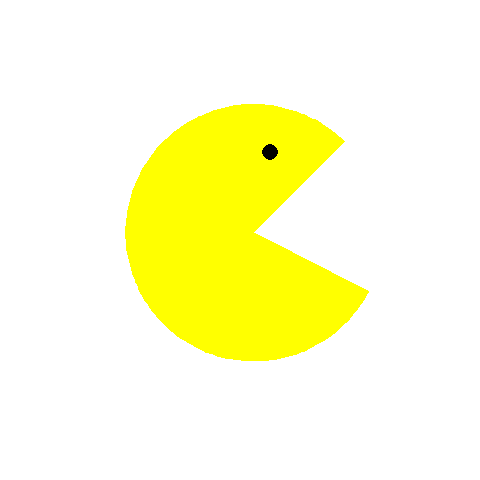

<!-- Check the code chunk 'setup' to see which packages you might need to install -->

<!-- first install knitr as follows: install.packages('knitr', repos='http://www.rforge.net/', type='source') 
-->

```{r label = setup, echo = FALSE, message = FALSE, warning = FALSE}
library(animation)
library(rgl)
library(knitr)
library(ggplot2)
library(googleVis)
library(tabplot)
library(plotrix)
library(metricsgraphics)
knit_hooks$set(webgl = hook_webgl)
```

# Recap

## Recap Week 3 learning objectives

- Recognize trickyness of factors and tables.

- Transformation and manipulation of data structures

- Identify the difference and usefulness of Implicit and Explicit loops.

- Obtain a statistical programmers' working strategy

- Write (Google's R style) functions


# Introduction

## Introduction

- Nynke Krol
- CBS
- Young Statisticians

- Topic of today: Visualization
- **Goals of visualization** 
    - Communicate
    - Extend possibilities of communication


# Lecture week 4| R graphics


## Week 4 learning objectives

- use the core function plot() included in package graphics

- adapt the layout of a traditional graph

- familiarize with `ggplot2`

- make static, interactive, and movie plots in R.

- get a hold on good and bad practices


## Visualization | Highly OS Dependent!


<div class="centered">

</div>


## Visualization: .Html vs. Pdf

Interactive plots are mainly for .html (related) files


Static plots for .pdf (e.g. reports)


# Visualization introduction

## Conventional static plots

- To visualize distributions and relationships
    - Histogram
    - Density estimator
    - Boxplot
    - Violinplot
    - Bar chart
    - Pie chart
    - Scatterplot

## Some examples using dataset mtcars

- Dataset mtcars (famous), measurements of 32 cars:
    - mpg: Miles/(US) gallon
    - cyl: Number of cylinders
    - disp:	Displacement (cu.in.)
    - hp: Gross horsepower
    - drat:	Rear axle ratio
    - wt: Weight (lb/1000)
    - qsec: 1/4 mile time
    - vs: V/S (V engine or Straight engine)
    - am: Transmission (0 = automatic, 1 = manual)
    - gear: Number of forward gears
    - carb: Number of carburetors
    
## mtcars data
```{r}
data(mtcars)
head(mtcars)
mtcars$cyl <- as.factor(mtcars$cyl)
mtcars$am <- as.factor(mtcars$am)
```

## Histogram with density estimator
```{r}
hist(mtcars$mpg, prob = TRUE, col = "lightyellow")
lines(density(mtcars$mpg), col = "red", lwd = 2)
```

## Histogram with normal density
```{r}
hist(mtcars$mpg, prob = TRUE, col = "lightyellow")
x = seq(10, 35, by = .01)
lines(x, dnorm(x, mean = mean(mtcars$mpg), sd = sd(mtcars$mpg)), 
      col = "red", lwd = 2)
```

## Boxplot
```{r}
boxplot(mtcars$mpg ~ mtcars$am, 
        xlab = "Transmission", ylab = "Miles per Gallon",
        names = c("Automatic", "Manual"))
```

## Scatterplot
```{r}
plot(mtcars$wt, mtcars$mpg)
```

## Scatterplot with regression line
```{r}
plot(mtcars$wt, mtcars$mpg)
abline(lm(mtcars$mpg ~ mtcars$wt))
```

## Parameters in plot (`?par`)
```{r, eval = FALSE}
par(bg = "cornsilk")
plot(mtcars$wt, mtcars$mpg, 
     col = mtcars$cyl, pch = as.numeric(mtcars$cyl), 
     main = "Miles per Gallon by Weight of Cars", 
     cex.main = 1.5, col.main = "blue", font.main = 3, 
     xlab = "Weight (lb/1000)", ylab = "Miles per Gallon", 
     cex.lab = 1.5, cex = 3)
legend("topright", col = 1:3, cex = 1.5, pch = 1:3, 
       legend = paste(levels(mtcars$cyl), 
      "cylinders", sep = " "))
abline(lm(mtcars$mpg ~ mtcars$wt), lwd = 2, col = "blue")
```

## Change parameters of standard package
```{r, eval = TRUE, message = FALSE, echo = FALSE, fig.height = 5, fig.width = 6}
par(bg = "cornsilk")
plot(mtcars$wt, mtcars$mpg,
  col = mtcars$cyl,
  pch = as.numeric(mtcars$cyl),
  main = "Miles per Gallon by Weight of Cars",
  cex.main = 1.5, col.main = "blue",
  cex.lab = 1.5,
  font.main = 3,
  xlab = "Weight (lb/1000)",
  ylab = "Miles per Gallon",
  cex = 3)
legend('topright', col = 1:3, cex = 1.5, pch = 1:3, legend = paste(levels(mtcars$cyl), "cylinders", sep = " "))
abline(lm(mtcars$mpg ~ mtcars$wt), lwd = 2, col = "blue")
```

# ggplot2

## ggplot2

- Hadley Wickham
- Implementation of Leland Wilkinsons [Grammar of Graphics](http://www.springer.com/us/book/9780387245447)
- Specific philosophy
- Layers
- Very popular R package


## ggplot2 histogram
```{r, warning = FALSE, message = FALSE}
ggplot(data = mtcars, aes(x = mpg)) + 
  geom_histogram()
```


## Histogram with density
```{r, warning = FALSE, message = FALSE}
ggplot(data = mtcars, aes(x = mpg)) +
  geom_histogram(aes(mpg, ..density..)) +
  geom_density(aes(mpg, ..density..))
```

## ggplot2 boxplot
```{r, warning = FALSE}
ggplot(data = mtcars, aes(x = 1, y = mpg)) + 
  geom_boxplot()
```

## ggplot2 scatterplot
```{r, warning = FALSE}
ggplot(data = mtcars, aes(x = wt, y = mpg)) + 
  geom_point()
```

## ggplot2 scatterplot with regression
```{r, warning = FALSE}
ggplot(data = mtcars, aes(x = wt, y = mpg)) + 
  geom_point() +
  geom_smooth(method = lm)
```

## Scatterplot with smooth line
```{r, warning = FALSE}
ggplot(data = mtcars, aes(x = wt, y = mpg)) + 
  geom_point() +
  geom_smooth(method = loess)
```

## ggplot2 facets
```{r, warning = FALSE}
ggplot(data = mtcars, aes(x = mpg)) + 
  geom_histogram(binwidth = 4) +
  facet_grid(am ~ .)
```

# ggplot2 `%>%` ggvis

## The operator `%>%`
- Forward pipe operator
- From package magrittr
- Forwards a value or result of an expression into the next function call/expression
- Uses in package `ggvis`
    - interactive `ggplot2` (and more)
    - "+ was the old Hadley"
- Other packages also use the forward pipe operator
    - e.g. `metricsgraphics`

## The operator `%>%`: Example
```{r}
mjs_plot(mtcars, x = wt, y = mpg) %>% 
  mjs_point(color_accessor = carb, size_accessor = carb) %>% 
    mjs_labs(x = "Weight of Car", y = "Miles per Gallon")
```

# Some more...

## Choice of graphs
- Common sense
- Situational and personal preference
    - E.g. `lattice`
- An R package for everything
    
    
    
- Developed at CBS
    - `tabplot`, among other packages

## tabplot
```{r, message = FALSE, echo = FALSE, fig.width=8, fig.height=5}
data(diamonds)
tab <- tableplot(diamonds)
```

## Good and bad practices
```{r, echo = FALSE, fig.width=9, fig.height=4}
par(mfrow=c(1,3))
barplot(table(iris$Species), col = rainbow(3), cex.names = 1.5, cex.axis = 1.5)
pie(table(iris$Species), col = rainbow(3), labels = c("set.", "vers.", "vir."), cex = 1.5)
pie3D(table(iris$Species), col = rainbow(3), labels = c("set.", "vers.", "vir."), explode = .1, cex = .5)
```

# .gif pictures in R 


## Using .gif files is cool!

<div class="centered">

</div>


## Pacman: the ingredients

```{r}
pie.matrix <- matrix(c(0.8, 0.2, 0.9, 0.1, 0.95, 0.05, 0.9, 0.1, 
    0.8, 0.2), 2, 5)
angle.vec <- c(45, 22.5, 11.25, 22.5, 45)
```   


<div class="centered">

</div>

## Pacman: draw one pacman

```{r, background='transparent'}
par(bg = NA)  # set background to transparent
pie(pie.matrix[, 1], init.angle = angle.vec[1], col = c("yellow", 
    "white"), border = NA, labels = NA, bg = NA)
points(0.1, 0.5, pch = 16, cex = 1.5)
```

## Pacman: A for loop

```{r, eval = FALSE}
par(bg = NA)
for (i in 1:4) {
    pie(pie.matrix[, i], init.angle = angle.vec[i], col = c("yellow", 
        "white"), border = NA, labels = NA, bg = NA)
    points(0.1, 0.5, pch = 16, cex = 3)
}
```

## Pacman function

```{r, eval = TRUE}
pacman <- function() {
    par(bg = NA)
    for (i in 1:4) {
        pie(pie.matrix[, i], init.angle = angle.vec[i], col = c("yellow", 
            "white"), border = NA, labels = NA, bg = NA)
        points(0.1, 0.5, pch = 16, cex = 3)
    }
}
```

## SaveGIF

```{r, message = FALSE, eval = TRUE}
obj <- animation::saveGIF(pacman(), movie.name = "pacman.gif", 
    interval = 0.5, width = 580, height = 400, outdir = getwd())
```




# RGL

## An example

```{r testgl, webgl=TRUE, eval = TRUE}
x <- sort(rnorm(1000))
y <- rnorm(1000)
z <- rnorm(1000) + atan2(x, y)
plot3d(x, y, z, col = rainbow(1000), bg = NA)
```


